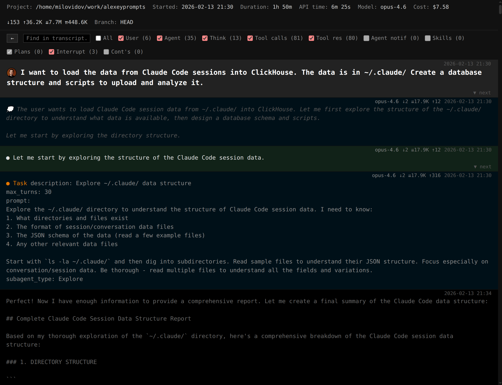

## Read the blog: [https://clickhouse.com/blog/agentic-coding](https://clickhouse.com/blog/agentic-coding)

### Alexey Prompts

A viewer of Claude Code sessions with ClickHouse backend.



### How to use

Create a ClickHouse database:

```
CREATE DATABASE IF NOT EXISTS claude_code;

CREATE TABLE IF NOT EXISTS claude_code.raw
(
    path String,
    data JSON
)
ENGINE = ReplacingMergeTree
ORDER BY (data.sessionId::String, data.timestamp::String, data.uuid::String);

CREATE TABLE TABLE IF NOT EXISTS claude_code.classification
(
    data JSON
)
ENGINE = ReplacingMergeTree
ORDER BY data.session_id::String;
```

Upload your sessions:

```
clickhouse-local -q "
    SELECT _path AS path, json AS data
    FROM file('$HOME/.claude/projects/*/*.jsonl', 'JSONAsString')
    WHERE isValidJSON(json)
    SETTINGS input_format_allow_errors_ratio=0.1
    FORMAT Native
" | clickhouse-client --host '...' --password '...' -q "INSERT INTO claude_code.raw FORMAT Native"
```

This is likely optional:

```
clickhouse-local -q "
    SELECT _path AS path, json AS data
    FROM file('$HOME/.claude/history.jsonl', 'JSONAsString')
    WHERE isValidJSON(json)
    SETTINGS input_format_allow_errors_ratio=0.1
    FORMAT Native
" | clickhouse-client --host '...' --password '...'  -q "INSERT INTO claude_code.raw FORMAT Native"
```

Edit `index.html` around CH_URL, CH_USER, CH_PASSWORD with your database credentials.

Optional: ask claude to run classification scripts and fill the classification table.

Open `index.html`.

### Do not share your sessions publicly

The sessions contain tool calls and results, including fragments of arbitrary filess. They may contain sensisive info, that's why it's not recommended to share sessions publicly.
